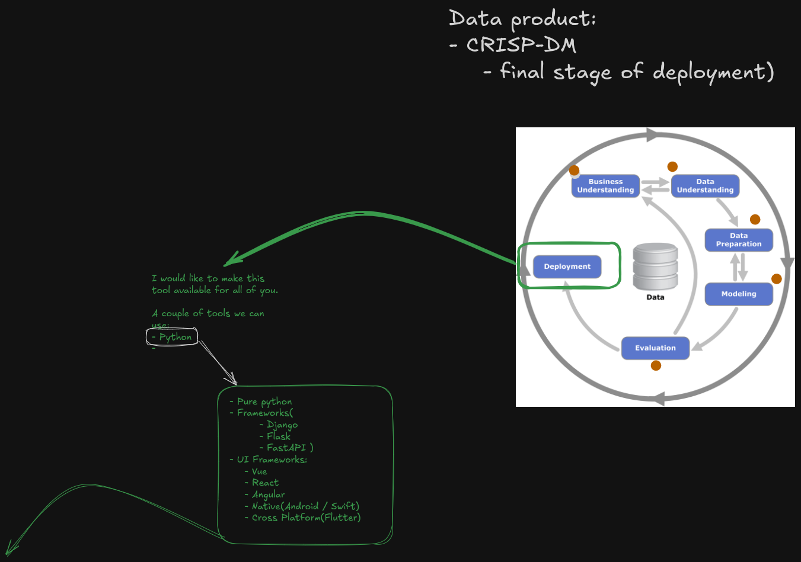
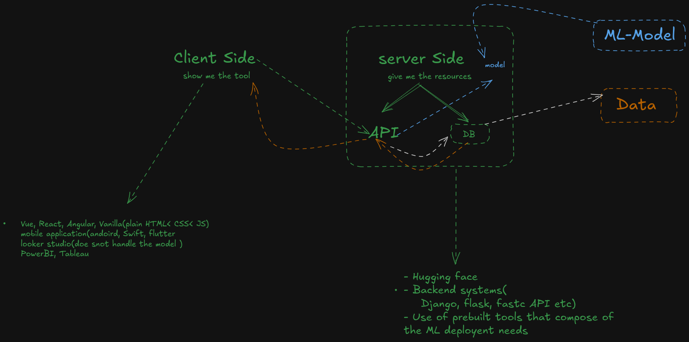

Start here: 
- Run this `pip install streamlit pandas matplotlib seaborn numpy`

To run a streamlit application:
    - open terminal make sure th envrionment is activated
    - run `streamlit run intro-streamlit.py` - kindly note: `intro-streamlit.py` is the name of my python file